# Photon-Exposure-Engine (Lux Exposure Calculator)

**Android App (Java): Professional Photography Exposure Converter**


🇬🇧 **English** · [🇮🇹 Italiano](#photon-exposure-engine-lux-exposure-calculator-1)

> ⚠️ **IMPORTANT: READ THIS FIRST**
>
> This source code is made public **ONLY FOR INSPECTION AND TO SHOWCASE THE AUTHOR'S WORK ON GITHUB**.
> Public access does not permit copying or reusing the code, in whole or in part, in forks, personal or third-party projects, derivative works, products, or services.
> You are **NOT PERMITTED** to run, execute, deploy, or use this software for its intended purpose (exposure calculation) unless you purchase the official commercial version from the Google Play Store.  
> See the [LICENSE](./LICENSE.md) file for full legal terms.

Converts an illuminance value in lux, measured by a light meter, into the photographic exposure triad: **ISO**, **aperture (f-number)**, and **shutter speed**. It also corrects reciprocity failure for supported film stocks.

---

## 📱 About this repository

This repository contains the full source code for the **Photon-Exposure-Engine (Lux Exposure Calculator)** app.

It is published **solely** to:

* Showcase development skills
* Allow photographers and developers to inspect the code without reusing it
* Document the mathematical foundation behind exposure calculation

**The source code is not open source and is not licensed for reuse.** You may not use a fork or other reproduction of this repository as the basis for another project, copy or modify any part of the code, create derivative works, or incorporate it into your own or a third party's project, product, or service. This prohibition applies to personal, educational, professional, production, and commercial projects.

The official, ready-to-use version is available for purchase on the Google Play Store.

---

## 📸 Screenshots

Complete interface coverage in both light and dark themes.

| Screen | Dark theme | Light theme |
|---|---|---|
| Digital workspace | <a href="screenshots/dark_01_digital_top.png">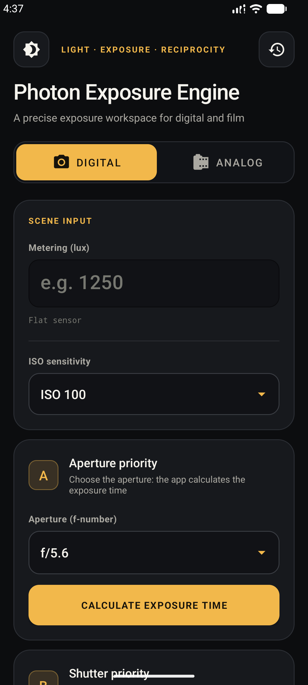</a> | <a href="screenshots/light_01_digital_top.png">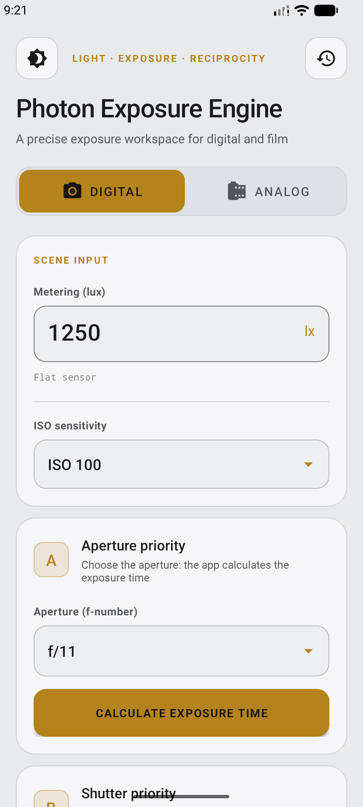</a> |
| Digital result | <a href="screenshots/dark_02_digital_results.png">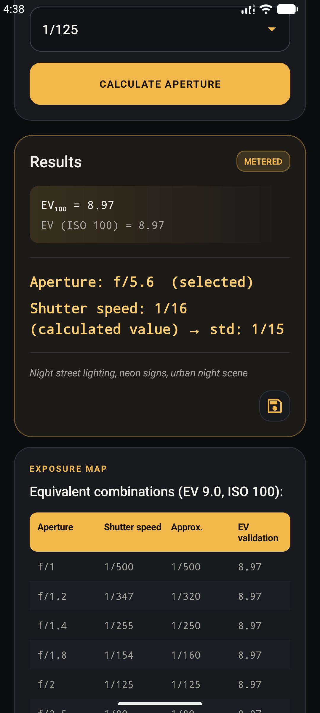</a> | <a href="screenshots/light_02_digital_results.png">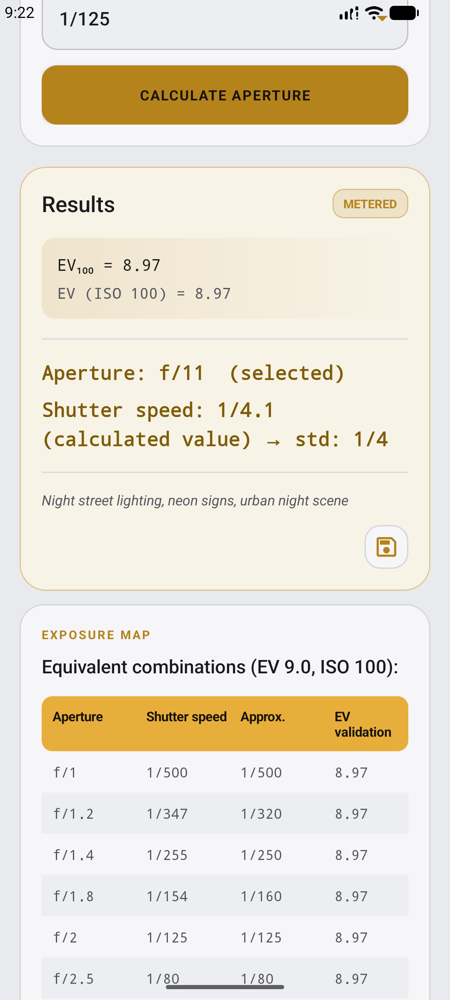</a> |
| Exposure map | <a href="screenshots/dark_03_digital_exposuremap.png">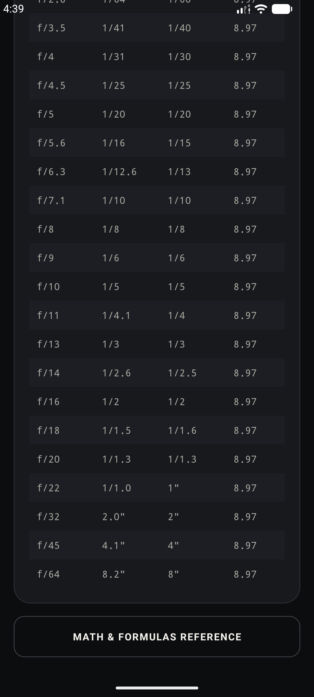</a> | <a href="screenshots/light_03_digital_exposuremap.png">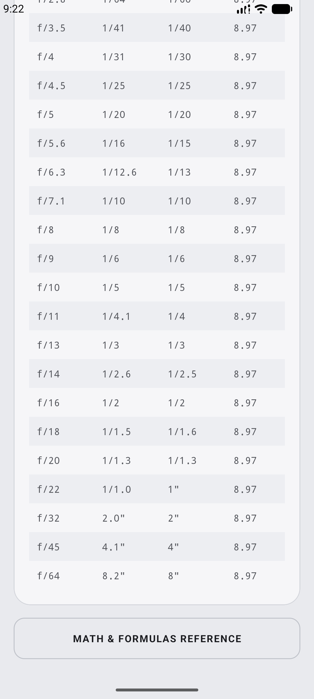</a> |
| Formula reference, part 1 | <a href="screenshots/dark_04_formulas_1.png">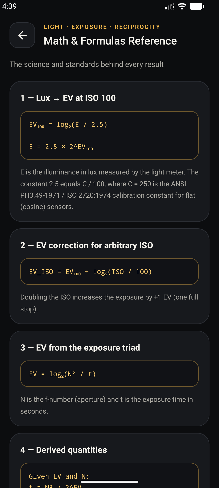</a> | <a href="screenshots/light_04_formulas_1.png">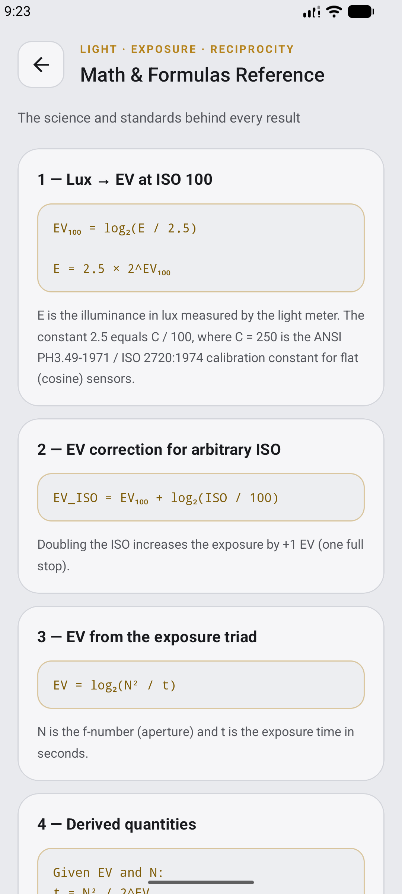</a> |
| Formula reference, part 2 | <a href="screenshots/dark_05_formulas_2.png">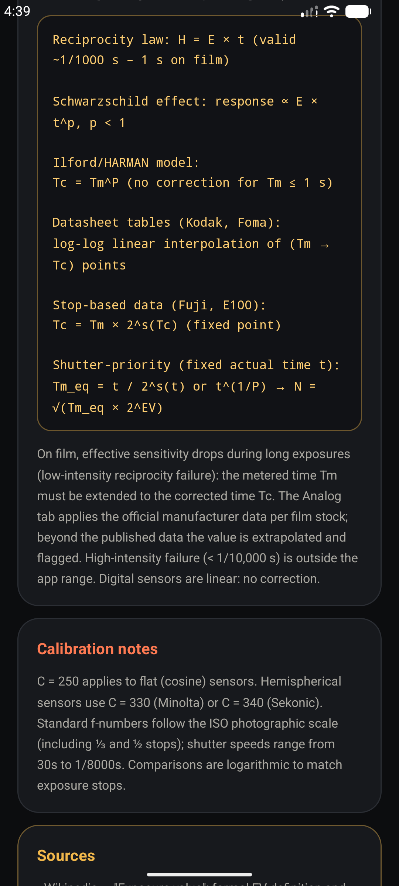</a> | <a href="screenshots/light_05_formulas_2.png">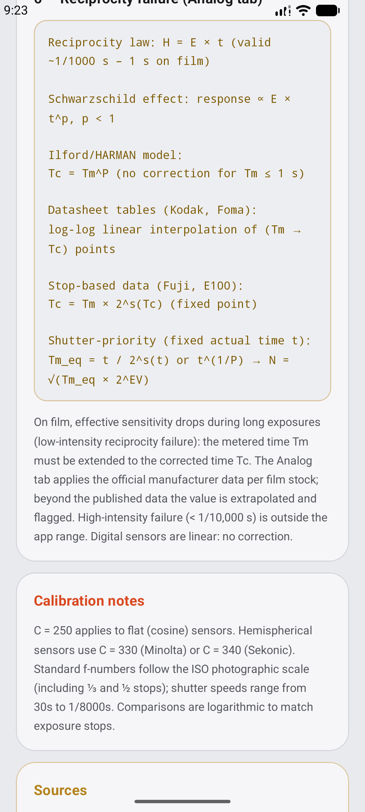</a> |
| Analog workspace | <a href="screenshots/dark_06_analog_top.png">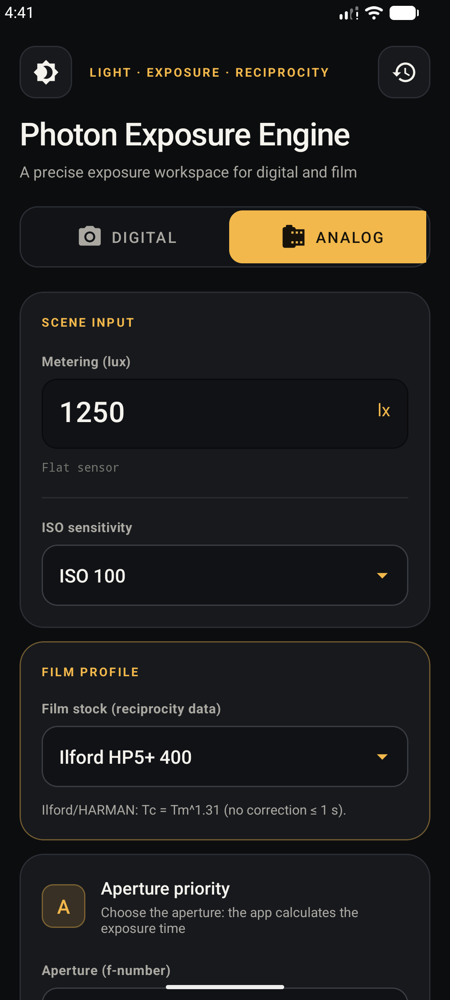</a> | <a href="screenshots/light_06_analog_top.png">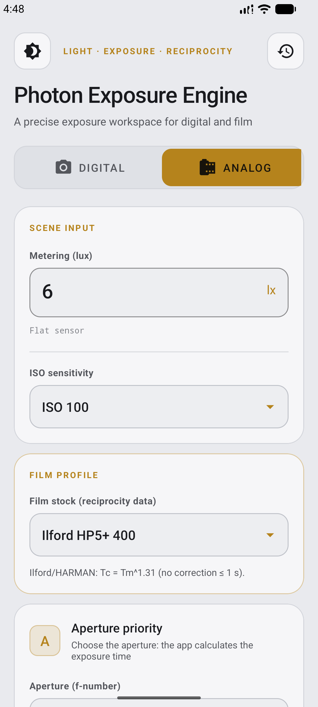</a> |
| Analog result | <a href="screenshots/dark_07_analog_result.png">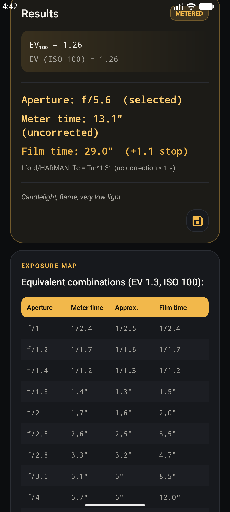</a> | <a href="screenshots/light_07_analog_result.png">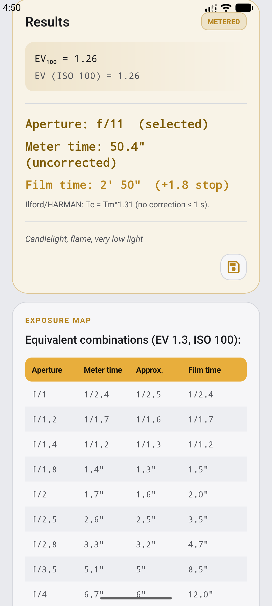</a> |
| Save exposure dialog | <a href="screenshots/dark_08_dialog_save.png">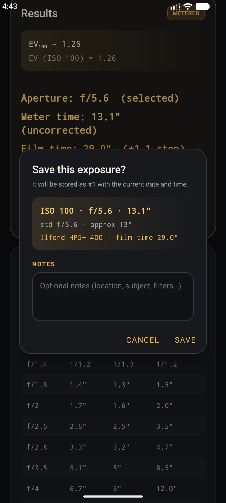</a> | <a href="screenshots/light_08_dialog_save.png">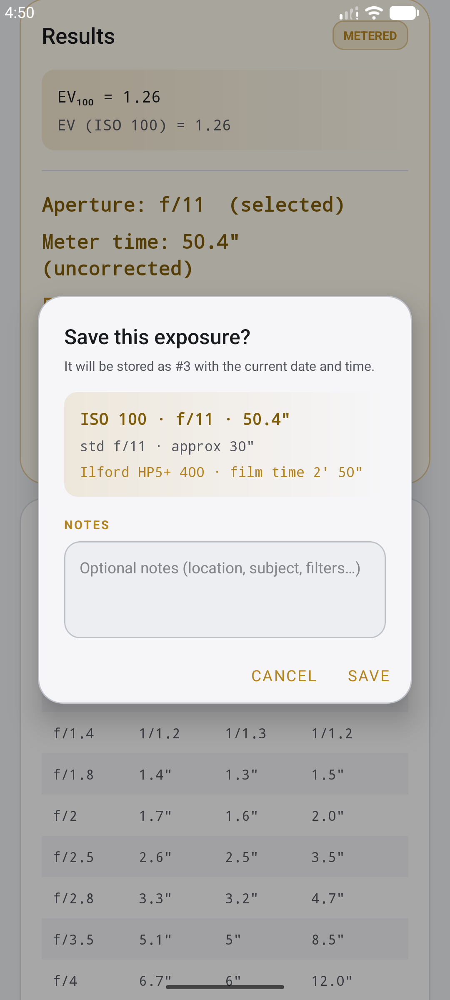</a> |
| Saved exposures | <a href="screenshots/dark_09_saved.png">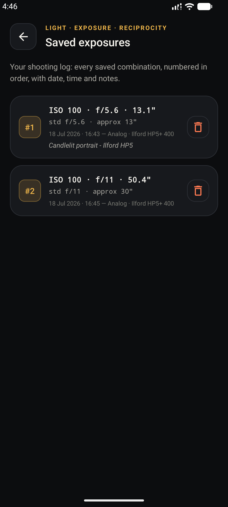</a> | <a href="screenshots/light_09_saved.png">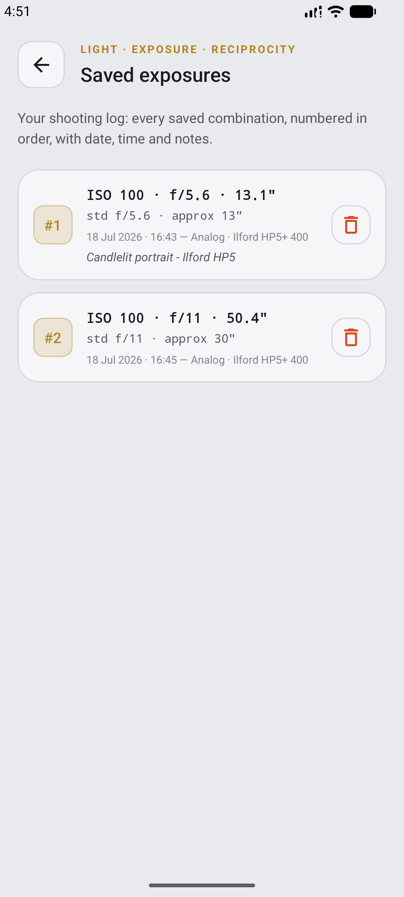</a> |
| Saved exposure detail | <a href="screenshots/dark_10_dialog_detail.png">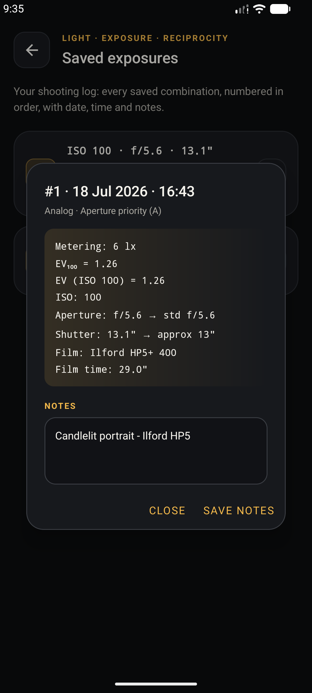</a> | <a href="screenshots/light_10_dialog_detail.png">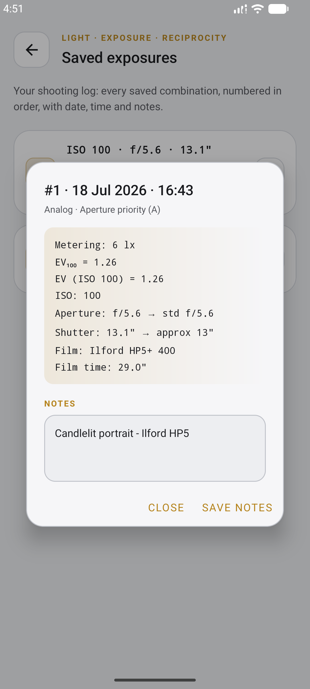</a> |

---

## ⚙️ App features

### Input

* **Lux value**: manual input from light meter
* **ISO**: selectable (25 → 102400)
* **Digital / Analog tabs**: Analog adds film selection and reciprocity correction
* **Film stock**: 21 selectable stocks (Ilford, Kentmere, Kodak, Fujifilm, Foma, generic B&W)

### Calculation modes

| Mode                      | Fixed input   | Calculated    |
| ------------------------- | ------------- | ------------- |
| **A: Aperture Priority** | f-number      | Shutter speed |
| **B: Shutter Priority**  | Shutter speed | f-number      |

### Output

* EV at ISO 100 (`EV100`)
* EV corrected for selected ISO (`EV_ISO`)
* Aperture (exact value + nearest standard value)
* Shutter speed (exact value + nearest standard value)
* Reciprocity-corrected time on the Analog tab, with a flag when the value is extrapolated beyond published data
* Scene description based on EV
* Full table of equivalent exposure combinations

### Screens

| Screen | Purpose |
|---|---|
| `MainActivity` | Exposure calculator, Digital/Analog tabs, dark-theme toggle |
| `FormulasActivity` | In-app reference for the formulas documented below |
| `SavedExposuresActivity` | Log of saved exposures, persisted locally |

---

## 📐 Mathematical formulas

### 1. Lux → EV at ISO 100

```
EV100 = log2(E / 2.5)
```

Where:

* `E` = illuminance in lux
* `2.5 = C / 100`, with `C = 250` (ANSI PH3.49-1971 / ISO 2720:1974 calibration constant for flat/cosine sensors)

Equivalent form:

```
E = 2.5 × 2^EV100
```

---

### 2. EV correction for arbitrary ISO

```
EV_ISO = EV100 + log2(ISO / 100)
```

Doubling ISO increases exposure by **+1 EV (one stop)**.

---

### 3. EV definition from the exposure triad

```
EV = log2(N² / t)
```

Where:

* `N` = f-number (aperture)
* `t` = exposure time in seconds

---

### 4. Given EV and aperture → shutter speed

```
t = N² / 2^EV
```

### 5. Given EV and shutter speed → aperture

```
N = √(t × 2^EV)
```

---

### 🔁 Cross-validation

All combinations `(N, t)` satisfying:

```
EV = log2(N² / t)
```

produce the **same exposure**.  
The app includes a table of equivalent combinations to demonstrate this principle.

---

### 6. Reciprocity failure in the Analog tab

The reciprocity law `H = E × t` holds on film only in the mid range, approximately from 1/1000 s to 1 s.
For long exposures the effective sensitivity of the emulsion drops
(**low-intensity reciprocity failure**, Schwarzschild effect: response ∝ `E × t^p`, `p < 1`),
so the metered time `Tm` must be extended to a corrected time `Tc`.
The **Analog** tab applies the official manufacturer data of the selected film stock;
the **Digital** tab applies no correction (digital sensors are linear).

**Ilford / HARMAN model** (official, "Film Reciprocity Failure Compensation", Dec 2023; no correction for `Tm ≤ 1 s`):

```
Tc = Tm^P
```

| Film | P | Film | P |
|---|---|---|---|
| Pan F+ 50 | 1.33 | SFX 200 | 1.43 |
| FP4+ 125 | 1.26 | XP2 Super 400 | 1.31 |
| HP5+ 400 | 1.31 | Ortho+ 80 | 1.25 |
| Delta 100 | 1.26 | Kentmere Pan 100 | 1.26 |
| Delta 400 | 1.41 | Kentmere Pan 400 | 1.30 |
| Delta 3200 | 1.33 | Generic B&W | 1.30 |

**Datasheet tables** (log-log linear interpolation between published points):

| Film | Published points (metered → corrected) |
|---|---|
| Kodak Tri-X 320/400 (F-4017) | 1 s→2 s, 10 s→50 s, 100 s→1200 s (dev −10/−20/−30%) |
| Kodak T-Max 100 (F-4016) | 1 s→+1/3 stop, 10 s→15 s, 100 s→200 s |
| Kodak T-Max 400 (F-4043) | ≤1 s none, 10 s→+1/3 stop, 100 s→300 s |
| Fomapan 100 Classic | 1 s→×2, 10 s→×8, 100 s→×16 |
| Fomapan 400 Action | 1 s→×1.5, 10 s→×6, 100 s→×8 |

**Stop-based data** (the correction `s(t)` refers to the *actual* exposure time,
so the corrected time solves the fixed point `Tc = Tm × 2^s(Tc)`):

| Film | Data |
|---|---|
| Fuji Acros II (AF3-0258E) | none <120 s; +1/2 stop from 120 to 1000 s |
| Fuji Provia 100F | none up to 128 s; beyond: test |
| Fuji Velvia 50 (RVP50) | 4 s→+1/3 (CC 5M), 8 s→+1/2, 16 s→+2/3, 32 s→+1 stop; ≥64 s not recommended |
| Kodak Ektachrome E100 | ~+1/2 stop from 20 to 40 s (approximate) |

**Shutter-priority mode (B):** with a fixed *actual* time `t`, the equivalent
metered time is `Tm_eq = t / 2^s(t)` (or `t^(1/P)`), and the aperture becomes
`N = √(Tm_eq × 2^EV)` (i.e. the aperture opens by `log2(t / Tm_eq)` stops).

Beyond the published manufacturer data the value is extrapolated and flagged in the UI.
High-intensity failure (exposures < 1/10,000 s) is outside the app range.

---

## 📚 Sources

| Source                       | Description                                     |
| ---------------------------- | ----------------------------------------------- |
| Wikipedia, "Exposure value" | Formal EV definition and lux/EV reference table |
| ANSI PH3.49-1971             | Calibration constant C = 250                    |
| ISO 2720:1974                | International light meter standard              |
| ANSI PH2.7-1986              | EV reference table for real-world scenes        |
| HARMAN Technology (Dec 2023) | "Film Reciprocity Failure Compensation"; Tc = Tm^P factors |
| Kodak F-4016 / F-4017 / F-4043 | T-Max 100, Tri-X, T-Max 400 long-exposure tables |
| Fujifilm AF3-0258E, RVP50 Data Guide | Acros II, Velvia 50, Provia 100F reciprocity data |
| Foma datasheets              | Fomapan 100/400 "Schwarzschild effect" tables   |

---

## 🧱 Project structure

```
Photon-Exposure-Engine/
├── app/
│   ├── build.gradle
│   └── src/
│       ├── main/
│       │   ├── AndroidManifest.xml
│       │   ├── java/com/photography/luxexposimeter/
│       │   │   ├── ExposureCalculator.java      # EV / aperture / shutter math
│       │   │   ├── FilmStock.java               # per-film reciprocity data
│       │   │   ├── ReciprocityCalculator.java   # Schwarzschild correction
│       │   │   ├── ExposureLogStore.java        # persistence of saved exposures
│       │   │   ├── SavedExposure.java           # saved-exposure model
│       │   │   ├── MainActivity.java            # calculator screen
│       │   │   ├── FormulasActivity.java        # in-app formula reference
│       │   │   └── SavedExposuresActivity.java  # saved-exposure log
│       │   └── res/
│       │       ├── layout/                      # activity, dialog, item layouts
│       │       ├── values/                      # strings, colors, themes
│       │       ├── values-night/colors.xml      # dark theme palette
│       │       ├── drawable/                    # icons and backgrounds
│       │       └── mipmap-*/                    # launcher icons
│       └── test/java/com/photography/luxexposimeter/
│           ├── ExposureCalculatorTest.java
│           └── ReciprocityCalculatorTest.java
├── Samples/                                     # screenshots
├── build.gradle
├── settings.gradle
├── gradle.properties
├── LICENSE.md
└── README.md
```

---

## 🚀 How to import in Android Studio

1. Open Android Studio
2. **File → Open** → select the `Photon-Exposure-Engine/` folder
3. Wait for Gradle sync
4. Connect a device (API 23+) or start an emulator
5. Press **Run** ▶

> **Reminder:** Importing and building the project is allowed for code inspection only.  
> Running the compiled app on a device is **prohibited** without purchasing the commercial version.

### Requirements

* Android Studio version compatible with **AGP 9.2.1** (see the
  [AGP / Android Studio compatibility table](https://developer.android.com/studio/releases#android_gradle_plugin_and_android_studio_compatibility))
* Android Gradle Plugin 9.2.1 · Gradle 9.6.1
* compileSdk / targetSdk 37
* minSdk 23 (Android 6.0 Marshmallow)
* Java 17

---

## 🧪 Unit tests

`ExposureCalculatorTest.java` verifies:

* Lux → EV100 conversion
* EV correction for ISO
* Shutter speed from EV + aperture
* Aperture from EV + shutter speed
* Round-trip calculation (EV → N, t → EV)
* Equivalent exposure combinations
* Formatting of shutter speeds and apertures

`ReciprocityCalculatorTest.java` verifies the Analog-tab math:

* Ilford power model (official HP5+ example: 10 s → 20.4 s)
* Exact datasheet points for Kodak, Foma, Fuji tables
* Fixed-point solution for stop-based data (Velvia 50, Acros II, E100)
* Inverse (shutter-priority) round-trips
* Monotonicity, `Tc ≥ Tm`, beyond-data flags, long-time formatting

Both suites are pure Java (no Android dependencies). Run them via Gradle:

```bash
./gradlew testDebugUnitTest
```

Each class also exposes a `main()` that prints a per-assertion pass/fail report,
so the suites can be run standalone without Gradle or the Android SDK. Only the
JUnit jar is needed on the classpath:

```bash
JUNIT=$(find ~/.gradle/caches -name 'junit-4.13.2.jar' | head -1)
cd app/src/main/java/com/photography/luxexposimeter
javac -cp "$JUNIT" -d /tmp/pee \
      ExposureCalculator.java FilmStock.java ReciprocityCalculator.java \
      ../../../../../test/java/com/photography/luxexposimeter/*.java
java -cp "/tmp/pee:$JUNIT" com.photography.luxexposimeter.ExposureCalculatorTest
java -cp "/tmp/pee:$JUNIT" com.photography.luxexposimeter.ReciprocityCalculatorTest
```

---

## 🧠 Technical notes

* `C = 250` is valid for **flat (cosine) sensors** and is the constant the app uses
* Hemispherical sensors use a different constant: `C = 330` (Minolta) or `C = 340` (Sekonic);
  the code exposes `C_HEMI = 330` for reference
* Standard f-numbers follow ISO photographic scale (including 1/3 and 1/2 stops)
* Shutter speeds range from **30s to 1/8000s**; the equivalent-combination table is
  filtered to that range
* Reciprocity-corrected times can far exceed 30 s and are formatted as minutes/hours
* Comparisons are logarithmic to match exposure stops

---

## 📄 License

Copyright © 2026 Antonio Dicorato. All rights reserved.

This source code is made publicly available on GitHub **solely for inspection and to showcase the author's work**. Its presence in a public repository does not make it open source or grant permission to reuse the code.

**You are strictly PROHIBITED from:**

- Running, executing, or deploying this software for any purpose.
- Using the application for its intended photographic exposure calculation purpose or any similar real-world functionality.
- Using a fork or other reproduction of the repository as the basis for another project, or copying, modifying, or creating derivative works from the code or any portion of it.
- Incorporating the code, in whole or in part, into personal or third-party projects, products, services, coursework submissions, internal tools, or production systems.
- Distributing, sublicensing, or making the software available to third parties in any compiled or executable form.
- Using or exploiting the source code or application for commercial, professional, or business purposes without an authorized purchase or a separate written license.

If you wish to use this application for its intended purpose (exposure calculation, photography assistance, or any practical functionality), you **MUST purchase the commercial version** from the Google Play Store. The commercial version is the only authorized way to use the software as an application.

For commercial licensing or permission requests:  
**[antoniodicoratoinfodev@gmail.com](mailto:antoniodicoratoinfodev@gmail.com)**

### Disclaimer

This software is provided *"as is"*, without warranty of any kind.  
The author is not liable for any damages arising from its use.

---

## 📦 App availability

The full application will be available for purchase on the Google Play Store.

---

# Photon-Exposure-Engine (Lux Exposure Calculator)

**App Android (Java): Convertitore Professionale per Esposizione Fotografica**


[🇬🇧 English](#photon-exposure-engine-lux-exposure-calculator) · 🇮🇹 **Italiano**

> ⚠️ **IMPORTANTE: LEGGI PRIMA**
>
> Questo codice sorgente è reso pubblico **SOLO PER ISPEZIONARLO E MOSTRARE IL LAVORO DELL'AUTORE SU GITHUB**.
> L'accesso pubblico non autorizza a copiare o riutilizzare il codice, in tutto o in parte, in fork, progetti propri o di terzi, opere derivate, prodotti o servizi.
> **NON È CONSENTITO** eseguire, avviare, distribuire o usare questo software per il suo scopo principale (calcolo dell'esposizione) a meno che non si acquisti la versione commerciale ufficiale dal Google Play Store.  
> Consulta il file [LICENSE](./LICENSE.md) per i termini legali completi.

Converte un valore di illuminamento in lux, misurato con un luxmetro, nella triade fotografica dell'esposizione: **ISO**, **apertura (f-number)** e **tempo di esposizione**. Corregge inoltre il difetto di reciprocità per le pellicole supportate.

---

## 📱 Informazioni su questo repository

Questo repository contiene il codice sorgente completo dell'app **Photon-Exposure-Engine (Lux Exposure Calculator)**.

È pubblicato **esclusivamente** per:

* Mostrare competenze di sviluppo
* Consentire a fotografi e sviluppatori di ispezionare il codice senza riutilizzarlo
* Documentare le basi matematiche del calcolo dell'esposizione

**Il codice sorgente non è open source e non è concesso in licenza per il riutilizzo.** Non è consentito usare un fork o un'altra riproduzione del repository come base per un altro progetto, copiare o modificare parti del codice, creare opere derivate oppure incorporarlo in progetti, prodotti o servizi propri o di terzi. Il divieto si applica a progetti personali, didattici, professionali, di produzione e commerciali.

La versione ufficiale e pronta all'uso è disponibile per l'acquisto su Google Play Store.

---

## 📸 Screenshot

| | | |
|---|---|---|
| 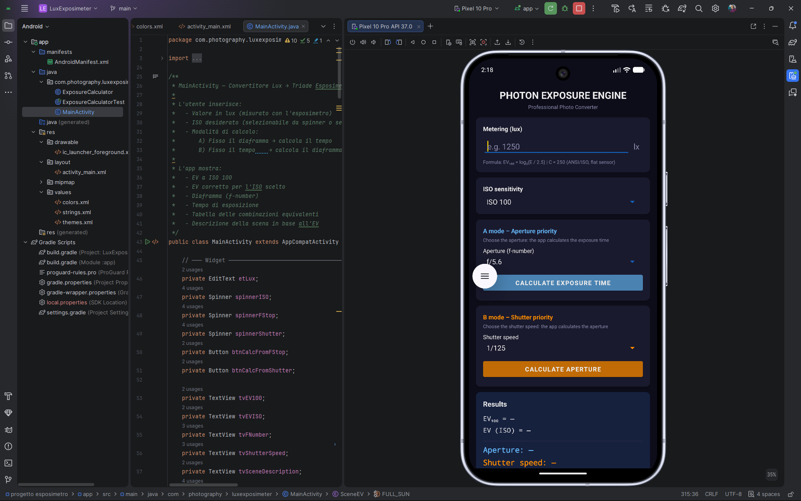 | 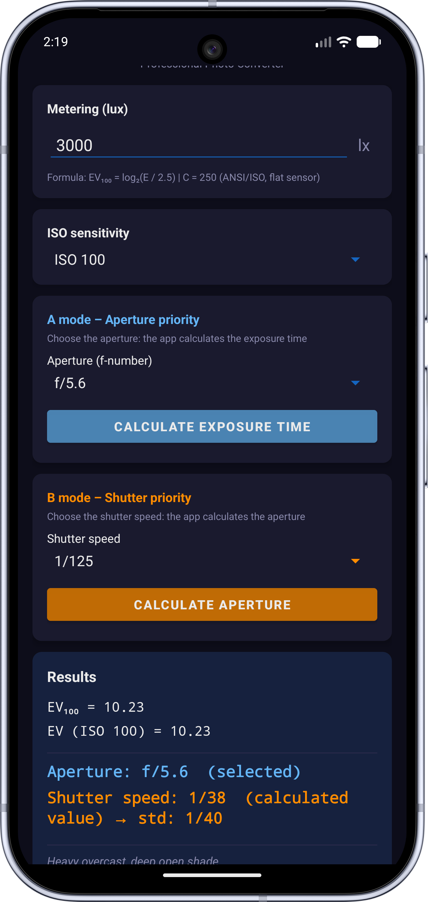 | 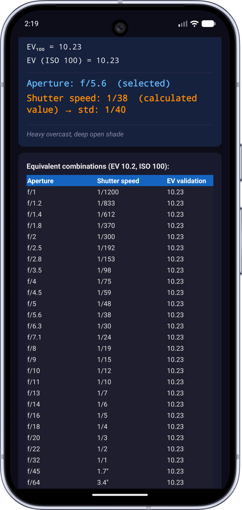 |

---

## ⚙️ Funzionalità dell'app

### Input

* **Valore in lux**: inserimento manuale dal luxmetro
* **ISO**: selezionabile (25 → 102400)
* **Tab Digital / Analog**: il tab Analog aggiunge la scelta della pellicola e la correzione di reciprocità
* **Pellicola**: 21 emulsioni selezionabili (Ilford, Kentmere, Kodak, Fujifilm, Foma, B&N generica)

### Modalità di calcolo

| Modalità                    | Input fisso          | Calcolato            |
| --------------------------- | -------------------- | -------------------- |
| **A: Priorità Apertura**   | f-number             | Tempo di esposizione |
| **B: Priorità Otturatore** | Tempo di esposizione | f-number             |

### Output

* EV a ISO 100 (`EV100`)
* EV corretto per ISO selezionato (`EV_ISO`)
* Apertura (valore esatto + valore standard più vicino)
* Tempo di esposizione (valore esatto + valore standard più vicino)
* Tempo corretto per la reciprocità nel tab Analog, con segnalazione quando il valore è estrapolato oltre i dati pubblicati
* Descrizione della scena basata su EV
* Tabella completa delle combinazioni equivalenti di esposizione

### Schermate

| Schermata | Scopo |
|---|---|
| `MainActivity` | Calcolatore di esposizione, tab Digital/Analog, interruttore tema scuro |
| `FormulasActivity` | Riferimento in-app per le formule documentate qui sotto |
| `SavedExposuresActivity` | Registro delle esposizioni salvate, persistito localmente |

---

## 📐 Formule matematiche

### 1. Lux → EV a ISO 100

```
EV100 = log2(E / 2.5)
```

Dove:

* `E` = illuminamento in lux
* `2.5 = C / 100`, con `C = 250` (costante di calibrazione ANSI PH3.49-1971 / ISO 2720:1974 per sensori flat/cosine)

Forma equivalente:

```
E = 2.5 × 2^EV100
```

---

### 2. Correzione EV per ISO arbitrario

```
EV_ISO = EV100 + log2(ISO / 100)
```

Raddoppiare l'ISO aumenta l'esposizione di **+1 EV (uno stop)**.

---

### 3. Definizione di EV dalla triade di esposizione

```
EV = log2(N² / t)
```

Dove:

* `N` = f-number (apertura)
* `t` = tempo di esposizione in secondi

---

### 4. Dato EV e apertura → tempo di esposizione

```
t = N² / 2^EV
```

### 5. Dato EV e tempo di esposizione → apertura

```
N = √(t × 2^EV)
```

---

### 🔁 Validazione incrociata

Tutte le combinazioni `(N, t)` che soddisfano:

```
EV = log2(N² / t)
```

producono la **stessa esposizione**.  
L'app include una tabella di combinazioni equivalenti per dimostrare questo principio.

---

### 6. Difetto di reciprocità nel tab Analog

La legge di reciprocità `H = E × t` vale sulla pellicola solo nel range medio
(circa da 1/1000 s a 1 s). Alle lunghe esposizioni la sensibilità effettiva
dell'emulsione cala (**difetto di reciprocità a bassa intensità**, effetto
Schwarzschild: risposta ∝ `E × t^p`, `p < 1`): il tempo misurato `Tm` va
allungato al tempo corretto `Tc`. Il tab **Analog** applica i dati ufficiali
del produttore per la pellicola selezionata; il tab **Digital** non applica
alcuna correzione (i sensori digitali sono lineari).

**Modello Ilford / HARMAN** (ufficiale, "Film Reciprocity Failure Compensation",
dic 2023; nessuna correzione per `Tm ≤ 1 s`):

```
Tc = Tm^P
```

| Pellicola | P | Pellicola | P |
|---|---|---|---|
| Pan F+ 50 | 1.33 | SFX 200 | 1.43 |
| FP4+ 125 | 1.26 | XP2 Super 400 | 1.31 |
| HP5+ 400 | 1.31 | Ortho+ 80 | 1.25 |
| Delta 100 | 1.26 | Kentmere Pan 100 | 1.26 |
| Delta 400 | 1.41 | Kentmere Pan 400 | 1.30 |
| Delta 3200 | 1.33 | B&N generica | 1.30 |

**Tabelle da datasheet** (interpolazione lineare in scala log-log tra i punti pubblicati):

| Pellicola | Punti pubblicati (misurato → corretto) |
|---|---|
| Kodak Tri-X 320/400 (F-4017) | 1 s→2 s, 10 s→50 s, 100 s→1200 s (sviluppo −10/−20/−30%) |
| Kodak T-Max 100 (F-4016) | 1 s→+1/3 stop, 10 s→15 s, 100 s→200 s |
| Kodak T-Max 400 (F-4043) | ≤1 s nessuna, 10 s→+1/3 stop, 100 s→300 s |
| Fomapan 100 Classic | 1 s→×2, 10 s→×8, 100 s→×16 |
| Fomapan 400 Action | 1 s→×1.5, 10 s→×6, 100 s→×8 |

**Dati in stop** (la correzione `s(t)` si riferisce al tempo di scatto *effettivo*,
quindi il tempo corretto risolve il punto fisso `Tc = Tm × 2^s(Tc)`):

| Pellicola | Dati |
|---|---|
| Fuji Acros II (AF3-0258E) | nessuna <120 s; +1/2 stop da 120 a 1000 s |
| Fuji Provia 100F | nessuna fino a 128 s; oltre: test |
| Fuji Velvia 50 (RVP50) | 4 s→+1/3 (CC 5M), 8 s→+1/2, 16 s→+2/3, 32 s→+1 stop; ≥64 s sconsigliato |
| Kodak Ektachrome E100 | ~+1/2 stop da 20 a 40 s (approssimato) |

**Modalità priorità otturatore (B):** con tempo di scatto *effettivo* `t` fisso, il
tempo equivalente misurato è `Tm_eq = t / 2^s(t)` (oppure `t^(1/P)`) e il
diaframma diventa `N = √(Tm_eq × 2^EV)`, cioè si apre di `log2(t / Tm_eq)` stop.

Oltre i dati pubblicati dal produttore il valore è estrapolato e segnalato
nella UI. Il failure ad alta intensità (esposizioni < 1/10.000 s) è fuori dal
range dell'app.

---

## 📚 Fonti

| Fonte                        | Descrizione                                               |
| ---------------------------- | --------------------------------------------------------- |
| Wikipedia, "Exposure value" | Definizione formale di EV e tabella di riferimento lux/EV |
| ANSI PH3.49-1971             | Costante di calibrazione C = 250                          |
| ISO 2720:1974                | Standard internazionale per luxmetri                      |
| ANSI PH2.7-1986              | Tabella di riferimento EV per scene reali                 |
| HARMAN Technology (dic 2023) | "Film Reciprocity Failure Compensation"; fattori Tc = Tm^P |
| Kodak F-4016 / F-4017 / F-4043 | Tabelle lunghe esposizioni T-Max 100, Tri-X, T-Max 400  |
| Fujifilm AF3-0258E, RVP50 Data Guide | Dati reciprocità Acros II, Velvia 50, Provia 100F |
| Datasheet Foma               | Tabelle "Schwarzschild effect" Fomapan 100/400            |

---

## 🧱 Struttura del progetto

```
Photon-Exposure-Engine/
├── app/
│   ├── build.gradle
│   └── src/
│       ├── main/
│       │   ├── AndroidManifest.xml
│       │   ├── java/com/photography/luxexposimeter/
│       │   │   ├── ExposureCalculator.java      # matematica EV / apertura / tempo
│       │   │   ├── FilmStock.java               # dati di reciprocità per pellicola
│       │   │   ├── ReciprocityCalculator.java   # correzione Schwarzschild
│       │   │   ├── ExposureLogStore.java        # persistenza esposizioni salvate
│       │   │   ├── SavedExposure.java           # modello esposizione salvata
│       │   │   ├── MainActivity.java            # schermata calcolatore
│       │   │   ├── FormulasActivity.java        # riferimento formule in-app
│       │   │   └── SavedExposuresActivity.java  # registro esposizioni salvate
│       │   └── res/
│       │       ├── layout/                      # layout activity, dialog, item
│       │       ├── values/                      # stringhe, colori, temi
│       │       ├── values-night/colors.xml      # palette tema scuro
│       │       ├── drawable/                    # icone e sfondi
│       │       └── mipmap-*/                    # icone launcher
│       └── test/java/com/photography/luxexposimeter/
│           ├── ExposureCalculatorTest.java
│           └── ReciprocityCalculatorTest.java
├── Samples/                                     # screenshot
├── build.gradle
├── settings.gradle
├── gradle.properties
├── LICENSE.md
└── README.md
```

---

## 🚀 Come importare in Android Studio

1. Aprire Android Studio
2. **File → Open** → selezionare la cartella `Photon-Exposure-Engine/`
3. Attendere la sincronizzazione di Gradle
4. Collegare un dispositivo (API 23+) o avviare un emulatore
5. Premere **Run** ▶

> **Promemoria:** L'importazione e la compilazione del progetto sono consentite solo per ispezione del codice.  
> L'esecuzione dell'app compilata su un dispositivo è **vietata** senza l'acquisto della versione commerciale.

### Requisiti

* Versione di Android Studio compatibile con **AGP 9.2.1** (vedi la
  [tabella di compatibilità AGP / Android Studio](https://developer.android.com/studio/releases#android_gradle_plugin_and_android_studio_compatibility))
* Android Gradle Plugin 9.2.1 · Gradle 9.6.1
* compileSdk / targetSdk 37
* minSdk 23 (Android 6.0 Marshmallow)
* Java 17

---

## 🧪 Test unitari

`ExposureCalculatorTest.java` verifica:

* Conversione Lux → EV100
* Correzione EV per ISO
* Tempo di esposizione da EV + apertura
* Apertura da EV + tempo di esposizione
* Calcolo round-trip (EV → N, t → EV)
* Combinazioni di esposizione equivalenti
* Formattazione di tempi di esposizione e aperture

`ReciprocityCalculatorTest.java` verifica la matematica del tab Analog:

* Modello Ilford Tc = Tm^P (esempio ufficiale HP5+: 10 s → 20.4 s)
* Punti esatti delle tabelle Kodak, Foma e Fuji
* Punto fisso per i dati in stop (Velvia 50, Acros II, E100)
* Round-trip dell'inversa (priorità di tempi)
* Monotonia, `Tc ≥ Tm`, flag oltre-dati, formattazione tempi lunghi

Entrambe le suite sono in Java puro (nessuna dipendenza Android). Esecuzione con Gradle:

```bash
./gradlew testDebugUnitTest
```

Ogni classe espone anche un `main()` che stampa un report pass/fail per singola
asserzione, quindi le suite si possono eseguire in standalone senza Gradle né
Android SDK. Serve solo il jar di JUnit nel classpath:

```bash
JUNIT=$(find ~/.gradle/caches -name 'junit-4.13.2.jar' | head -1)
cd app/src/main/java/com/photography/luxexposimeter
javac -cp "$JUNIT" -d /tmp/pee \
      ExposureCalculator.java FilmStock.java ReciprocityCalculator.java \
      ../../../../../test/java/com/photography/luxexposimeter/*.java
java -cp "/tmp/pee:$JUNIT" com.photography.luxexposimeter.ExposureCalculatorTest
java -cp "/tmp/pee:$JUNIT" com.photography.luxexposimeter.ReciprocityCalculatorTest
```

---

## 🧠 Note tecniche

* `C = 250` è valido per **sensori flat (cosine)** ed è la costante usata dall'app
* I sensori emisferici usano una costante diversa: `C = 330` (Minolta) oppure `C = 340` (Sekonic);
  il codice espone `C_HEMI = 330` come riferimento
* I f-number standard seguono la scala fotografica ISO (inclusi 1/3 e 1/2 stop)
* I tempi di esposizione vanno da **30s a 1/8000s**; la tabella delle combinazioni
  equivalenti è filtrata su questo intervallo
* I tempi corretti per la reciprocità possono superare di molto i 30 s e vengono
  formattati in minuti/ore
* I confronti sono logaritmici per corrispondere agli stop di esposizione

---

## 📄 Licenza

Copyright © 2026 Antonio Dicorato. Tutti i diritti riservati.

Questo codice sorgente è reso pubblico su GitHub **esclusivamente per consentirne l'ispezione e mostrare il lavoro dell'autore**. La presenza in un repository pubblico non lo rende open source e non concede alcun permesso di riutilizzo.

**È SEVERAMENTE VIETATO:**

- Eseguire, avviare o distribuire questo software per qualsiasi scopo.
- Utilizzare l'applicazione per il suo scopo previsto (calcolo dell'esposizione fotografica o qualsiasi funzionalità simile nel mondo reale).
- Usare un fork o un'altra riproduzione del repository come base per un altro progetto, oppure copiare, modificare o creare opere derivate dal codice o da qualsiasi sua parte.
- Incorporare il codice, in tutto o in parte, in progetti, prodotti, servizi, elaborati didattici, strumenti interni o sistemi di produzione propri o di terzi.
- Distribuire, concedere in sublicenza o mettere il software a disposizione di terzi in forma compilata o eseguibile.
- Utilizzare o sfruttare il codice sorgente o l'applicazione per scopi commerciali, professionali o aziendali senza un acquisto autorizzato o una licenza scritta separata.

Se desideri utilizzare questa applicazione per il suo scopo principale (calcolo dell'esposizione, assistenza fotografica o qualsiasi funzionalità pratica), **DEVI ACQUISTARE la versione commerciale** dal Google Play Store. La versione commerciale è l'unico modo autorizzato per usare il software come applicazione.

Per richieste di licenza commerciale o autorizzazioni:  
**[antoniodicoratoinfodev@gmail.com](mailto:antoniodicoratoinfodev@gmail.com)**

### Disclaimer

Questo software è fornito *"così com'è"*, senza alcuna garanzia.  
L'autore non è responsabile per eventuali danni derivanti dal suo utilizzo.

---

## 📦 Disponibilità dell'app

L'applicazione completa sarà disponibile per l'acquisto sul Google Play Store.
